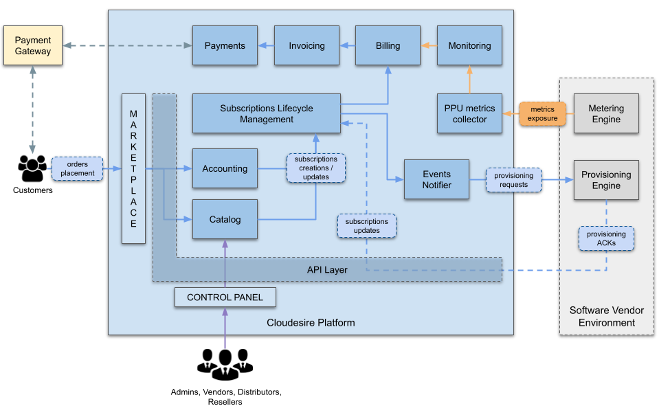

# Platform Architecture

Cloudesire is an Enterprice XaaS Marketplace Platform that allows to sell 
**subscriptions** on digital product/services provided by 3rd-parties.

The platform provides:
- customizable and brandable **Marketplace** interfaces for publishing 
  searchable and firterable products/services catalogs
- a web control panel to easily configure flexible **pricing models**, 
  supporting pre-paid and pay-per-use configurations and volume discounts
- an integrated **Monitoring Engine** for collecting, and billing, custom
  application metrics
- a **Subscription Lifecycle Management Engine**
- a **Billing Engine**, integrated with a native **Invoicing Engine**,
  also supporting **orders approval workflow**
- support for external **Payments Gateways**
- support for **Indirect Reselling Channels** 
- a documented **REST API Layer**, fully-covering the whole platform
  business logic
  
The **provisioning** process is typically in charge of the 3rd-party
providing the product/service to be sold on the marketplace, by 
implementing a [Syndication Workflow](syndication.md).

In case of **pay-per-use** pricing models, the 3rd-party will also
provide the Cloudesire Monitoring Engine with *actual values*
for all the *billable metrics* belonging to the end-users' running 
subscriptions.

# Main Topics

This website provides detailed documentation related to the following
topics:

- [Platform Modules](pletform.md): a more detailed platform architecture
  diagram, with a brief description of the various modules, along with an 
  explaination of the main concepts and a glossary. 
  This could be a good starting point for your reading!
- [Onboarding Workflow](onboarding.md): how to onboard a new product/service 
  on the Cloudesire marketplace
- [Channel Management](channel.md): how to configure a *Parent-Child Commerce
  Chain*, enabling multiple Distributors and Resellers
- [Orders Approval Workflow](approval-workflow.md): to enable use-cases where
  each order (new purchases, change requests) needs to be approved by a 
  privileged user before it becomes effective
- [REST API Guide](api.md): a complete guite to interact with the platform
  API Layer, along with examples and useful resources  
