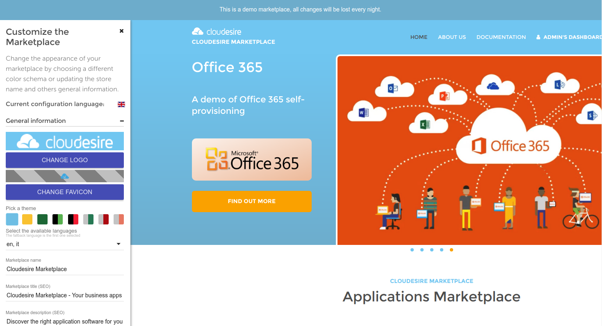
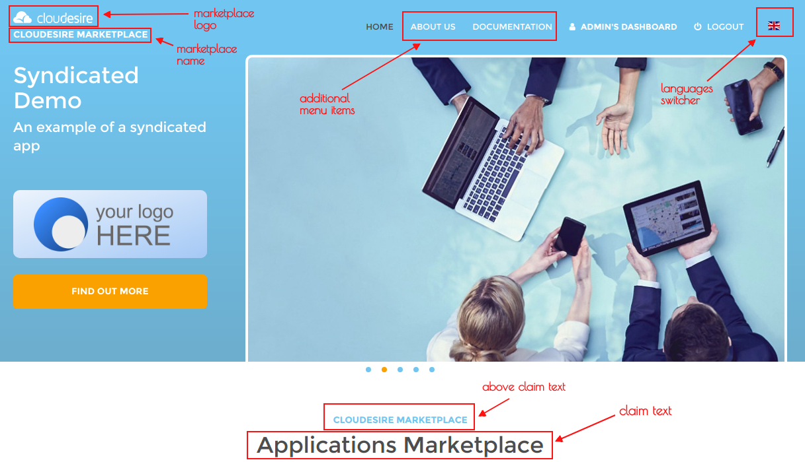
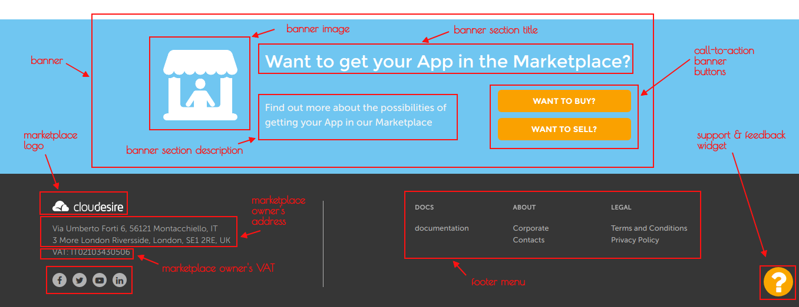

The marketplace provides a customization functionality which is
available only for *administrators*, and for *resellers* and
*distributors* if the "cloud4channel" module is available.

By clicking on the "customize" widget (upper-left border of the interface) a
sidebar will appear on the left side.

The sidebar options are grouped in different sections:

* **General information**: to configure logo, favicon, titles, descriptions...

* **Social links**: to add social accounts (e.g. Facebook, Twitter, YouTube,
  LinkedIn) URLs, plus 2 additional main menu items

* **Footer links**: to configure up to 4 groups of footer menu items

* **Partners banner configuration**: to configure a large banner positioned in
  the middle of the home page, immediately after the product list

* **Banner configuration**: to configure a different - and more flexible -
  banner section including an image plus 2 buttons enabling 2 CTAs

* **Integrations configuration**: to connect Google Analytics, Google TAG
  Manager, Re-Captcha, inject custom CSS rules.

## General Information

In the first part of the configuration section it’s  possible to setup:

* **marketplace logo**: to be positioned in the top-left of each interface
  favicon
* **theme**: it’s possible to select among one of the available color-schema
* **available languages**: it’s possible to decide which language to be provided
  into the "language switcher" (top-right of each interface)
* **marketplace name**: the label to be printed under the logo
* **marketplace title (SEO)**: the HTML title TAG for the marketplace home page
  marketplace
* **description (SEO)**: the HTML description TAG for the marketplace home page
* **claim text**:  the text to be printed on the center of the page, under the
  main slider, before the product category filter
* **above claim text**: a smaller text to be printed before the“claim text”

The same of above, for the bottom-side part of the interface.

In the second part of the configuration section it’s possible to setup:

* **address**: organized as 2 lines (to be printed on the marketplace footer,
  bottom-left)
* **VAT**: the marketplace owner’s VAT number (to be positioned on the footer, under
  the address)
* **ToS & Privacy acceptance text**: a HTML text to be provided to the end-user
  during the order-placement; this text needs to be read and accepted before
  placing an order
* **homepage products count**: number of products to be listed on the home page (a
  "load more" button is always visible when more products are available)
* **hide help tooltip**: the possibility to disable the “help tooltips” from the
  Customer Dashboard and Vendor Control Panel
* **catalog mode**: customize catalog appearance
  * *Standard*: this is the default option; the marketplace shows prices  and
    allows the end-users to place orders
  * *Price list*: the marketplace shows prices but the end-users are not allowed
    to place orders
  * *Showcase*: the marketplace only lists the products in the catalog, without
    showing prices nor allowing the end-users to place orders

## Social Links

In this configuration section it’s possible to setup the URLs of the main social
networks, plus 2 additional "main menu items":

* Facebook, Twitter, YouTube, LinkedIn URLs: the social networks’ “company
  pages”. For each link, a specific icon will be printed on the marketplace
  footer
* Additional links: it’s possible to define the anchors and the URLs related to
  2 menu items to be added to the marketplace main menu

## Footer Links

In this configuration section it’s possible to setup up to 4 groups of footer menu items.

For each group it’s firstly possible to specify a name (eg. "About", “Legal”, etc.).

Secondly, for each group it’s possible to specify up to 3 links, and for each of
them it’s possible to set the link anchor (“link name”) and its related URL
(“link URL”).

## Partners Banner Configuration

In this section it’s possible to upload a "big banner image" which will “fit”
the entire width of the homepage (AKA “partners banner”).

The suggested image size is 1200px wide.

It’s strongly recommended to upload PNG with transparent background.

The following input is a “color picker”; it allows to define the background color of the “horizontal section” of the interface hosting the banner.

## Banner Configuration

In this section it’s possible to configure the "main banner" section of the
marketplace.

Compared to the “partners banner”, this section offers a higher level of
configuration; in fact, it’s possible to:

* upload an image (the suggested size is 120px x 120px)
* define a title for the section
* define a description for the section
* define text and URL  for 2 additional buttons (call-to-actions)
* Please refer to Figure 2 to understand how the rendering of this section looks like.

## Integrations configuration

In this section it’s possible to configure the integration with external
tracking / analytics platforms.

More specifically, it’s possible to define:

* Google TAG Manager code: to enable the tracking functionality via Google TAGs
  into the marketplace
* Google Analytics code: to enable the tracking functionality via "classical"
  Google Analytics code (when not using Analytics integration via Google TAG
  Manager)
* Re-Captcha public key: to Re-Captcha functionality  on the marketplace (where
  required). See [recaptcha docs](https://www.google.com/recaptcha/intro/v3.html)
* Custom CSS: it’s possible to define custom CSS rules which will be applied “on
  top” to the default marketplace stylesheets. This allows to easily and quickly
  apply small customizations to the platform interfaces