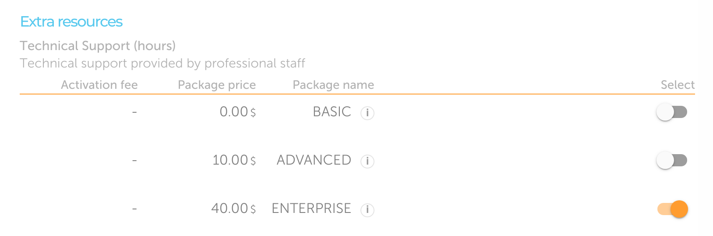
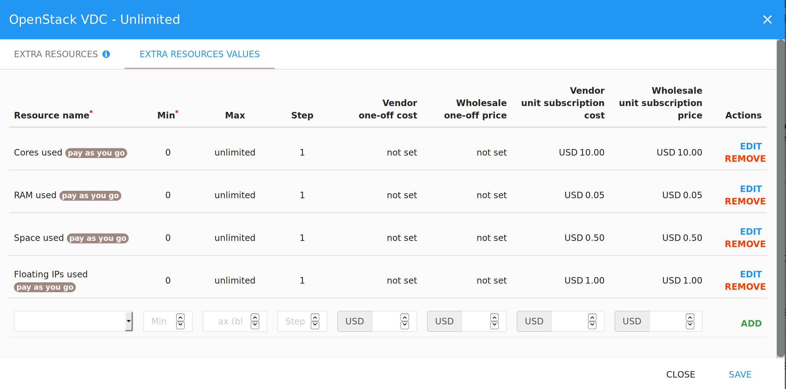

In this section you will learn what extra resources are and how you can add them
to your product plans.

## What is an Extra Resource

Extra Resources refer to _goods_ or _services_ which can be sold together with
the application (for example, a 10-days pack of technical support, hardware
components, extra credits, etc.) for which the customer will pay a recurring
price on each billing period.

## Pricing schemes

The platform supports 3 different pricing schemes for Extra Resources, based on
quantity usages: *tiered*, *volume* and *stairstep*.

### Tiered scheme

Tiered scheme means that every unit charge is calculated with its own tier
price.

With tiered scheme, once you fill up a *tier* you move to the next tier and
units are charged at a different price (usually lower).

Example:

* From 1 to 9 users: €5/user
* From 10 users: €3/user

If customer chooses 15 users, the total amount will be:
9 x € 5,00 + 6 x € 3,00 = € 63,00

### Volume scheme

Volume scheme means that all units charge is calculated based on total count in
the related tier: as soon as you reach a specific quantity, all units will cost
the lower price.

Example:

* From 1 to 9 users: €5/user
* From 10 users: €3/user

If customer chooses 15 users, the total amount will be:
15 units * € 3,00 = € 45,00

### Stairstep scheme

Stairstep scheme means that the total cost is calculated based on the price tier
and not per unit.

Vendors will propose different unit prices for various quantities of an item.

Example:

* From 1 to 9 users: €30
* From 10 users: €100

If customer chooses 15 users, the total amount will be: € 100,00

The following screenshot shows an example of _Extra Resources_ linked to a
specific [Product Plan.](glossary.md#product-plan)


Detailed instructions, explaining how to specify and manage Extra Resources
during the onboarding process, are provided in [this
section](glossary.md#extra-resources).

#### Tagged stairstep ranges

A stairstep range can optionally be tagged so that the customer will select the tag
instead of the quantity for the Extra Resource on the marketplace.

The following screenshot shows an example on how a tagged Extra Resource Value would
appear on the marketplace product page:



## Create an Extra Resource

To define a new Extra Resource, you need to have already created a product in
your catalog with at least one plan. Over to the plan where you want to define
Extra Resources and select "_Extra Resources_" action.

You will be required to add:

* _Resource Name_: the name of the extra resource. It will be shown to the
  customer in the marketplace
* _Identifier_: please make sure this is a unique identifier for the extra
  resource
* _Measuring Unit_: the measuring unit of the extra resource, for example hours,
  credits etc. You can select the measuring unit from the drop-down menu
* _Type_: choose among *Tiered*, *Volume* and *Stairstep* pricing scheme, as
  explained early
* _Description_: a short description of the extra resource. Please try to be
  clear and brief
* _Payment option_: when - and how much for - will the extra resource be billed:
  * __Pre-paid__: in full at the start of the billing period
  * __Post-paid__: in full at the end of the billing period, or proportional to
    the effective usage if terminated early
  * __Pay-as-you-go__: the resource quantity is not requested at buy, because it
    is defined by an application metric (counter or gauge, see the
    [application metrics](onboarding.md#application-metrics) section)
* _Required_ (yes/no): if the customer has to buy this resource to complete the
  product activation

Then, click on the "Add" button on the right.


The next step is to define the quantity ranges and their pricing. Go to the
"_Extra Resources Values_" section and fill:

* _Resource Name_: select from the combo-box on the left a previously created
  Extra Resource
* _Min_: Start quantity for the current interval (should not overlap the
  previous one)
* _Max_: End quantity for the current interval (may be empty in the last range to avoid defining an upper bound)
* _Step_: should be greater than or equal to 1. Decide which are the effective quantities
  inside the specified interval that are selectable by customers (e.g. with an
  interval from 0 to 100 and a step of 5, customer can buy a quantity of 0 or 5
  or 10 or 15 and so on)
* _Unit Price_: cost per quantity
* _One-off cost_ (optional): a setup price added one-time only



Repeat these steps to add multiple Extra Resources, when you're done click on
the *Save* button.

The following screenshot shows an example of Extra Resources linked to a
specific Product Plan.


## Extra Resources quantities via API

To retrieve the _Extra Resources Values_ specified by the customer during the
order placement, you can fetch the _Subscription_ resource using the [Cloudesire
API](api.md):

```http
GET /api/subscription/{id} HTTP/1.1
```

The response will contain the information explained in [this
section](syndication.md#retrieve-the-subscription-resource-after-a-subscription-created),
plus the `billingItems` property, which contains the chosen value for the extra
resource.

```http
HTTP/1.1 200 OK
Content-Type: application/json

{
    ...
    "billingItems": {
        "billingItem/1": 100,
        "billingItem/2": 50,
    },
    ...
}
```
