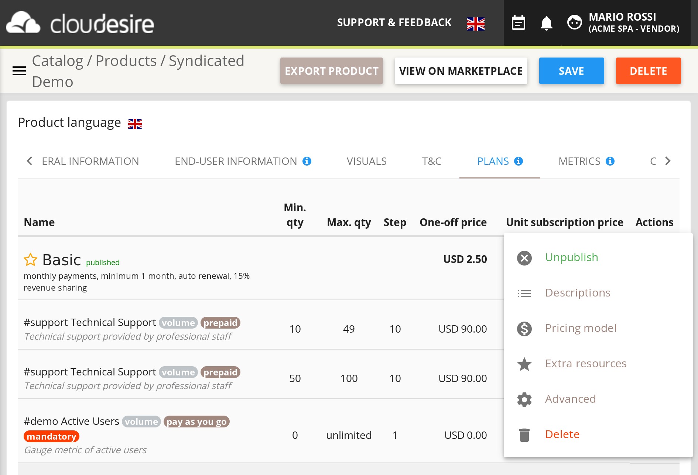
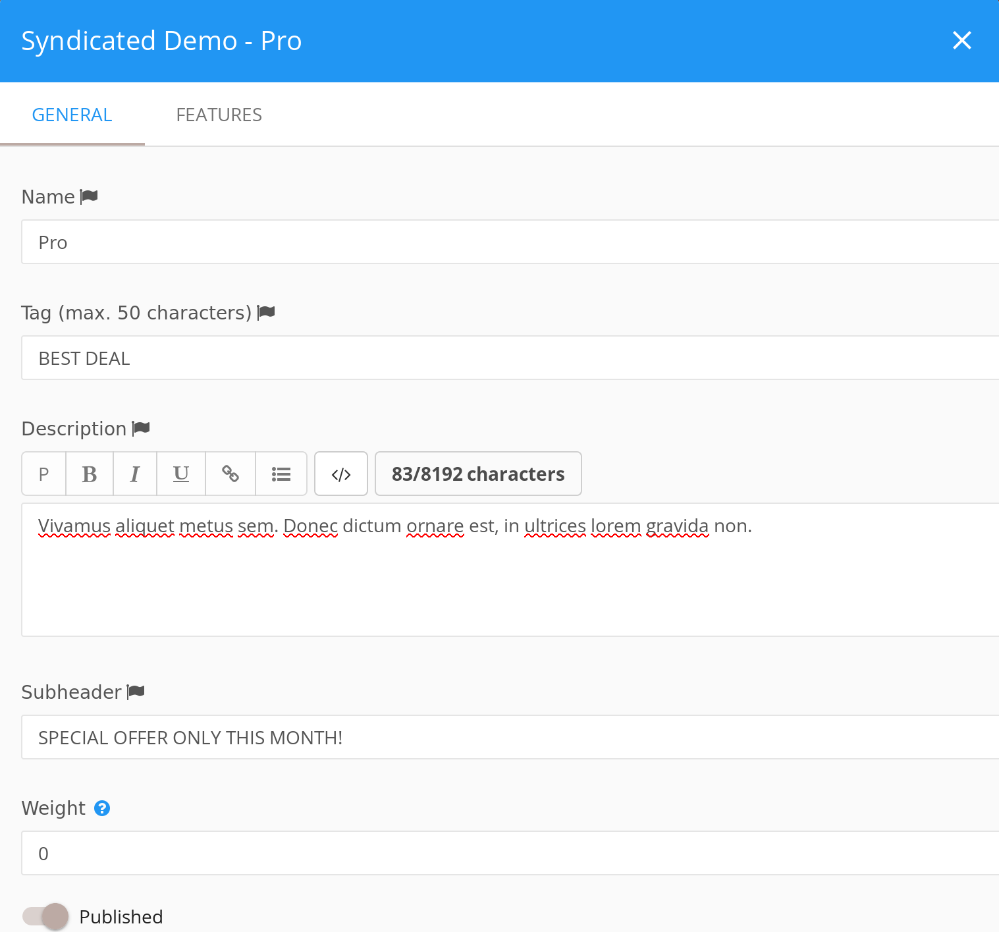
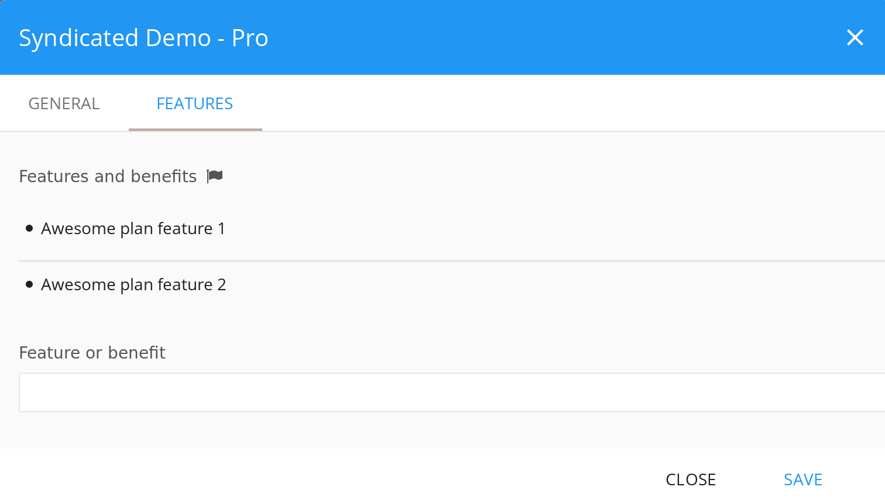
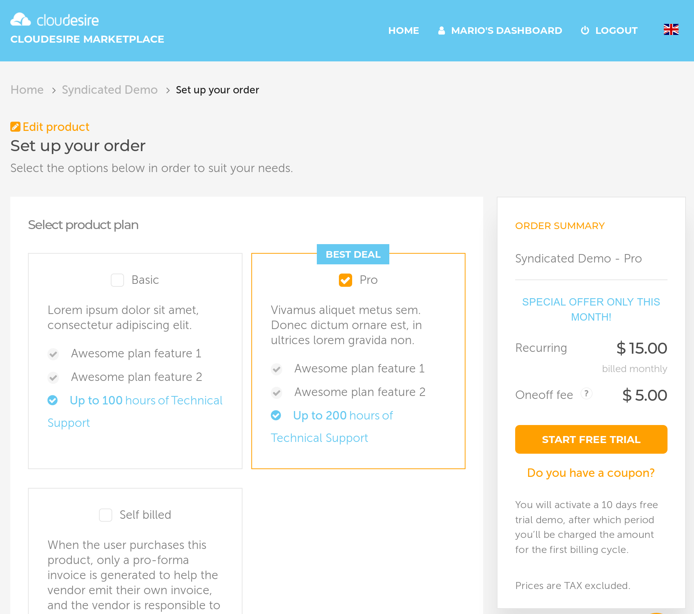

For each application, vendors can define one or more **Plans** (e.g. _silver_,
_gold_, _platinum_, etc.).

In short, plans are the product versions that will be available to your customer
to choose. In the following picture, you can see an example of the two product
versions created for a product: one is the monthly plan and one is the annual
plan.

## Edit a product plan

To add plans you need to go to access your personal Control Panel. You will be
able to access the "_Catalog_" from the menu on the left. Then you need to
select the product you want to edit, click on it, select "Edit" and go to the
"Plans" section.

Then, click on the "Add New Plan" button.

If you have already created a plan and you want to edit you can do it by
selecting a specific Plan, and clicking on the "Edit" button. A pop-up will show
up, similar to the one in the following picture:

### Descriptions

The *General* tab contains the following fields:

* **Name**: this is the name of the plan and will be shown to customers, keep it
  short and easy to understand. For example good plans could be
  gold/silver/bronze, basic/pro/enterprise, monthly/yearly
* **Tag**: colored ribbon that is useful to attract customer attention (e.g. 50%
  off!)
* **Description**: in this field you need to describe the peculiarities of this
  specific plan
* **Subheader**: a text that is shown on the order summary box on the marketplace
* **Weight**: alter the ordering of plans when they are listed (lower weight will
  float to the top of lists, while heavier products will sink)
* **Published** (yes/no): when active this plan is available for purchasing on the
  marketplace
* **External ID**: your identifier for this particular plan (useful to recognise
  it when consuming API)

This is an example configuration of a plan in the *General* tab:

The next tab is *Features*: here you can define a list of catchy descriptions
for this particular plan that can help the customer to choose between different
plans of the product:

This is how the plans shows up on the marketplace *setup order* page with the
previous example configuration:

### Pricing model

The *Pricing* tab contains the main setting to adjust the billing of a plan:

* **Auto-renewal** (yes/no): when activated, the subscription of the user that
  chose this plan will automatically renew at the expire date. The customer
  should request an unsubscribe before the renew take place in order to avoid
  renewal
* **IaaS billing** (Prepaid/Pay as you go): if IaaS costs should be paid in
  advance by the customer (prorated for the entire billing period) or
  pay-as-you-go (pay at the end of billing period or upon user termination)
  - available only for Bare-VM and Docker products

The **Pricing model** dropdown enables to select from a variety of options:

* **Renewable every N months**: you can adjust billing frequency (how often an
  invoice is emitted) and *minimum order duration* (how long a customer is
  committed to pay). *Recurring price* is charged at billing frequency, while
  *One-off price* is charged only at the first purchase (for further
  information see [this section](billing.md))
* **Short duration not renewable**: useful for services that are meant to be
  used on-demand, e.g. a webinar session.
* **Everlasting**: a subscription for this plan doesn't have an expiration date
  and can be terminated only by customer choice (e.g. a one-shot charge for
  buying a custom CMS theme)
* **Contact form only**: a pricing for this plan is undefined and the customer
  cannot place an order for it but can ask for more information to you
* **Free**: this plan is for products free to use (e.g. open-source)

The **Configurations** tab contains additional settings like:

* **Trial mode**: if you want to provide a trial period for this plan to your
  prospect. For Managed products you are going to be charged for the required
  cloud resources needed to run the application
  * Credit card (not) required: you can ask or not the customer to provide a
    valid credit card (without charging anything) in order to request a trial
* **Trial length**: when trial is enabled, how many days the trial can last. At
  any time the customer can request to upgrade to a paid plan. Upgrade to paid
  can happen automatically at the end of trial period if *Auto-Renewal* is
  enabled (the customer can unsubscribe without any costs before the end of the
  trial)
* **Coupon configuration**: whether using coupons is globally available for this
  plan or not. An option to require a coupon in order to buy a plan is also
  available
* **Upgrades available**: wheter a subscription of this plan can be upgraded to
  another one (e.g. upgrades are not feasible or are without meaning)

### Extra-Resources

Extra-resources are goods or services which can be sold together with the
product. Examples are a 10-days pack of technical support, some hardware
components.

In this section it's possible to configure the price ranges for each
Extra-Resource. For further information look at the
[Extra-Resources](onboarding-extra-resources.md) section.

### Advanced Settings

* **Configuration Parameters**: enable or disable configuration parameters that
  should have been already defined at product level. More details on the
  [Configuration Parameters](onboarding.md#configuration-parameters) section.
* **Integration Metadata**: a key/value list where you can put custom data,
  especially useful when developing integration for syndicated applications.
