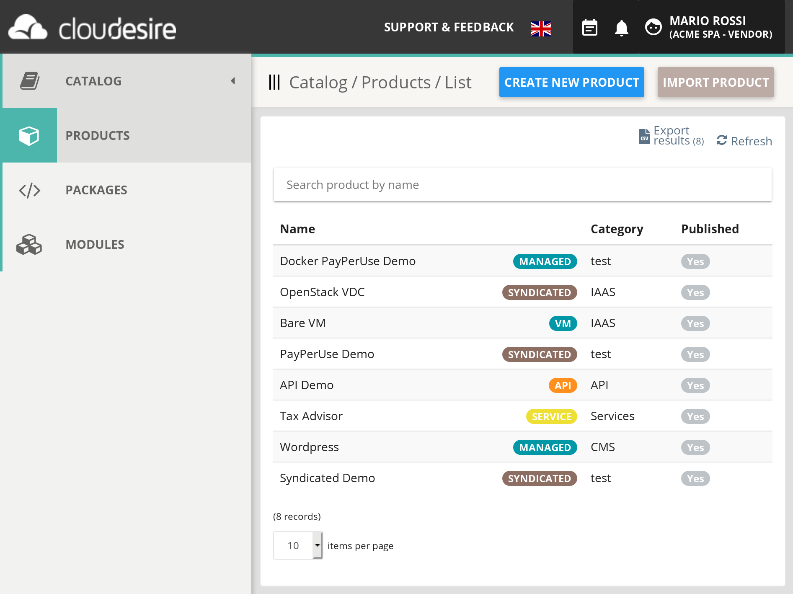
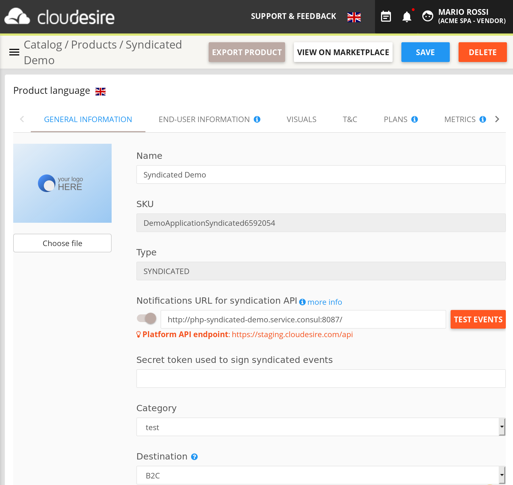
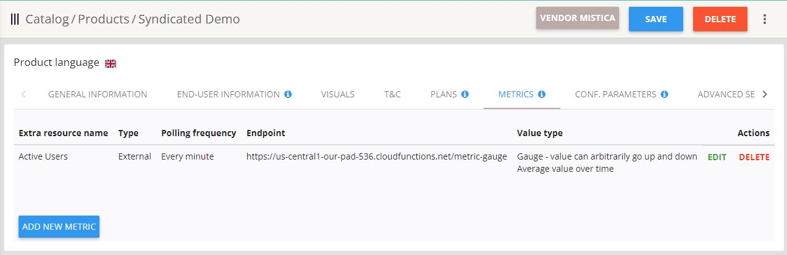
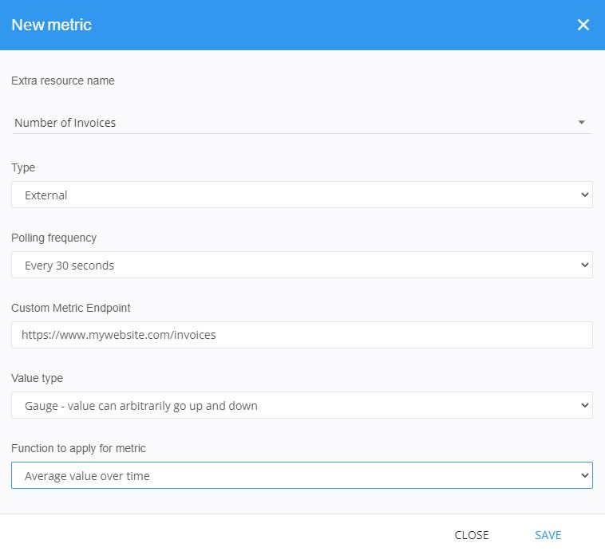
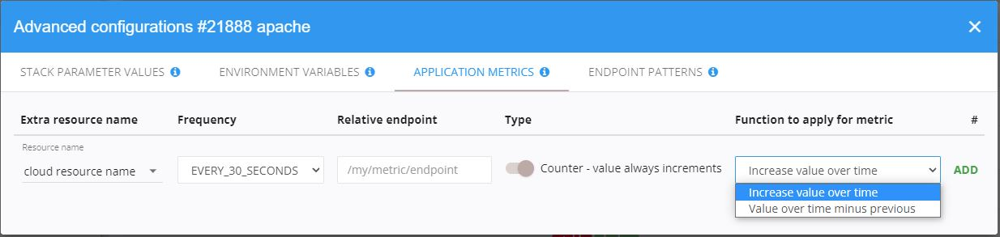

In this section you will learn how to start the onboarding process of your
application on the Cloudesire marketplace.

Please note that the technical section of the onboarding process is different
depending on the chosen **product type**: you need to clearly understand the
differences between the available product types to successfully complete the
onboarding of your product. Product type can't be changed after initial
creation.

> In order to see your product visible on the marketplace, at least
> one **Plan** should be _published_.

## Start the onboarding process

To start the onboarding process, go to the marketplace and login to access your
personal Control Panel.

Select _"Catalog"_ from the left menu, then select _"Products"_ and click on the
**Create New Product** button at the upper right hand corner.

You will see a pop-up in which you can  insert your product name and choose
between different product types:

* **Syndicated Product** to start onboarding a new product in
  [Syndication](syndication.md) mode
* **Docker Application** to start onboarding a new product using one or more
  [Docker image](docker.md)
* **Service Product** to start [onboarding a new service](service.md), that is
  not tied to the distribution of an application to the end-user
* **API Product** to onboard a new [API-based service](api-product.md)

Additional product types exists, but can be created and assigned to a vendor
only by an administrator:

* **CSP Product** to onboard a new Microsoft/Azure product, see the [CSP
  Product](csp-product.md) section;
* **Bare VM** to onboard a new bare Virtual-Machine with SSH access for
  customers, see the [VM product page](vm.md).

## Marketing & Sales Onboarding

In this section you will understand how to fill the product description, select
the right pricing model and publish it into the Cloudesire marketplace catalog.

The **Catalog** contains all the applications owned by the vendor. In this
section you can see both applications that are already published on the
marketplace and applications that are still in configuration phase.



### Product descriptions

Select a product and click on *Edit Product* lead the user to the page to start
editing name, description and images of a product.



Please note that you can save your product by clicking on "_Save Product_" on
the top right at any time.

### General Information

* **Logo**: a logo with transparent background and 350x300 px in resolution.
* **Product Name**: your application name. It's the name that will be associated
  with your product on the marketplace.
* **SKU**: your product ID. You cannot change it once the product has been
  created, it's good to identify a particular product when using API.
* **Category** (e.g. CMS, CRM): this will help customers to understand your
  product category and will be shown on your product page on the marketplace.
* **Destination** (B2B or B2C):  this will prevent private customers to buy the
  product if it's meant to be sold only to businesses.
* **Tags** (keyword list): these tags will help customers to quickly understand
  your product. Please, try to add only relevant tags to avoid too many tags on
  the product page.
* **Long and Short Description** (text): describe your product to customers. Try
  to focus on your product distinctive points for your ideal customers. You will
  have later dedicated sections to add benefits, features, details of each
  available plan, terms and conditions and privacy policy. Avoid too long
  descriptions that no-one is going to read entirely. Bullets can be very useful
  to avoid long paragraphs. This is the first thing customers will read about
  your product, so please make sure it's clear, catchy and always without typos.

> When localization support is enabled on the marketplace, you can see a flag
> around each localized field to switch languages. **Remember to fill all
> available languages**!

### End-User Information

* _End-user instructions_: this field is optional, you can add here information
  that the customer will read during the first access to the product, after
  making an order. Common examples are default login and password or how to ask
  for support.
* _Features and benefits_ (ordered list): features and benefits of your
  application. Please try to be clear and concise: customers will see this list
  as it is. We suggest to insert 3 or 6 features and benefits and avoid long
  lists.
* _FAQ_ (ordered list of Questions and Answers): you can add some relevant FAQs
  about your product. Remember to add questions that can be relevant to help
  customers to choose your product, not only troubleshooting or the most asked
  questions.

### Visuals

* _Video URL (YouTube or Vimeo)_: a video can be shown on the product page. A
  short and effective ads of your product is a good choice, avoid
  tutorials or walk-through.
* _Cover_: this picture is used only on the the marketplace homepage slider, if
  the product has been promoted to *featured* by the marketplace owner. Please
  use a captivating high-quality image of 820x465 px in resolution.
* _Screen-shots_ (list of images): these images will be shown to customers in
  the dedicated section, choose wisely which ones to show. Remember that is the
  first time that a potential customer will see your application in action:
  choose the most relevant or delightful sections of your application, avoid
  niche sections.

### Terms and conditions (T&C)

* _Terms of Service_: users will be able to read the terms of service of your
  application.
* _Service Level Agreement_: users will be able to read the service level
  agreement of your application.
* _Privacy Policy_: users will be able to read the privacy policy of your
  application.

> TOS, SLA and privacy are persistent after each purchase order, please avoid
> providing a link which content is subject to change during time.

### Plans

Plans are used to fine one or more product versions (e.g. silver, gold,
platinum, etc.): each plan have its billing configuration.

You can find more information about [pricing models](billing.md) and [how to
create a new plan](onboarding-plans.md).

### Metrics

Metrics represent _facts_ of a specific application that are relevant for
software vendors. To better understand metrics and how to add custom metrics to
your application, please read [this section](onboarding.md#application-metrics).

## Technical Onboarding

This section focuses on the technical aspects of the onboarding. We made the
technical onboarding as smooth as possible, anyway we strongly recommend you to
read this section before onboarding your product and during the onboarding
process.

### Onboarding for Syndicated and Docker applications

The technical part of the onboarding process depends on the application
_provisioning type_:

* for **Syndicated Applications**,  the software vendor
  has to provide a "_syndication endpoint_" and proceed with the integrations
  via API, as described in [this
  section](syndication.md)
* for **Docker Applications** (where Cloudesire will provision on the cloud a
  new virtual-machine containing a running instance of the application for each
  customer) the software vendor should use [Docker Packaging](docker.md) (a
  self-contained archive of your application meeting the
  [Docker](https://www.docker.com/) standards). More detailed instruction for
  the onboarding of Docker applications can be found in [this
  section](docker.md).
* for **Service**, the same rules of syndicated applications applies, but the
  integration is optional;
* for **API** products, please refer to the [API section](api-product.md).

The following sections refer to other additional functionalities, which can be
used both in the Syndicated and Docker applications.

### Application Metrics

#### Understanding Application Metrics

Application Metric (AKA _Custom Metrics_) represents _facts_ of a specific
application offered in the Cloudesire Marketplace that are relevant to software
vendors.

For example, a software vendor could be interested to know how many _documents_
a certain application instance produced in the last month, or how many _active
users_ an application has at a given time.

This kind of information are useful for **monitoring** purposes (i.e. to see a
dynamic real-time graph in the Cloudesire Dashboard), but also allows software
vendors to implement **pay-per-use** pricing models. In fact, specifying a
**unit-price** for a custom metric (e.g. 10 USD per active user) allows
Cloudesire to calculate the related incomes in a certain period of time
(_billing period_) and issue an invoice to the customer. For further details,
take a look at the [Billing Module Section](billing.md).

For each metric you can define from the "metrics" editing section, the
following information:

* _Extra resource name_: the name of the
  [extra resource](onboarding-extra-resources.md) that will be **linked**, which
  needs to be:
  * previously created
  * configured with *Payment Option* set as "pay as you go"
  * configured with its specific
    [pricing schema](onboarding-extra-resources.md#pricing-schemes)
* _Type_: can be:
  * *External*: when the actual values must be provided by a 3rd-party system,
  such as the vendor's platform
  * *Native*: when the actual values are automatically retrieved by Cloudesire
  itself; this is valid only for special cases, like [Docker Apps](docker.md)
  or [BareVM](vm.md) products
* _Polling frequency_: the platform will poll your endpoint with this frequency;
* _Custom Metric Endpoint_: must be defined in the form of a relative URL (e.g.:
  `/metric/users`);
* _Polling frequency_: the platform will poll your endpoint with this frequency;
* _Value type_: can be:
  * _Gauge_: value can arbitrarily go up and down
  * _Counter_: value always increments
* _Function to appy_: can be:
  * Average value over time
  * Peak value over time

Additional *custom Funtions* can be specified by the platform administrators.

#### How to add Custom Metrics

The steps to follow to a add one (or more) Custom Metric to a Product are
slightly different depending on your application _provisioning type_:

##### Adding Custom Metrics to a Syndicated Application

For [Syndicated Applications](syndication.md), you need to access to the product
editing page and go to the "_Metrics_" tab.

To find the "_Metric_" tab go to your personal Control Panel. You will be able
to access the "_Catalog_" from the menu on the left. Then you need to select the
product you want to add custom metrics to, click on it, select "Edit" and go to
the "_Metrics_" section.



By clicking on "_Add New Metric_", you will see a pop-up where you can set up a
new metric.



##### Adding Custom Metrics to a Docker Application

For [Docker applications](docker.md), you need to access to the "_Modules_"
section (more details [here](docker.md#modules).) which is available on the
left menu of your personal Control Panel.

Once you are in the "_Modules_" section, select a specific _Module_ and
_Package_ (more details [here](docker.md#packages)), click on the "_Show
Advanced_" button on the top-right of the page. Furthermore, by accessing to the
"_Application Metrics_" tab it's possible to fill all the required fields and
click on the "_Add_" button to finish.



#### How to provide "actual values" for a Custom Metric

In case of **Docker applications**, to be able to successfully use
application metrics, your application should expose an unique URL
for each application metric, reporting the *actual value* for that
metric, which will be accordingly related to a specific Docker
app's running **instance**.

The format of the metric data should be in JSON format:

```json
{
    "metricsName": "current_users",
    "value": 3.0
}
```

In case of **Syndicated applications**, the functioning is quite
similar: it's required to expose an URL returning the same JSON result,
by taking care of retrieving the **subscription ID** from the HTTP
header of the Cloudesire's request.
In this way, the URL will return the right *actual value* of the
metric for each specific **tenant**.
More details are available [here](syndication.md#application-metrics).

### Configuration Parameters

Applications may require a list of parameters that needs to be provided by
customers before using the application for the first time, either for the
application to work properly or to provide better initial customization.

Configuration Parameters are injected in Docker containers like
[Environment variables](docker.md#environment-variables), but their value is
chosen by customers before placing an order.

For any other product type, they are exposed via API (continue reading this
section).

Each parameter is created and bound to a specific Product, but must be activated
on one or more _Plans_. Each parameter can required or not, and its value can be
_validated_ by providing a regular expression. In order to support customers to
fully understand the meaning, each parameter has a _description_ and a _hint_.

To manage Configuration Parameters, enter the Product editing page, then
select the "_Configuration Parameters_" tab.

For each parameter you need to specify:

* _Code_: a unique identifier of the parameter. It is not shown to the customer
* _Name_: a name for the parameter. It will be shown to the customer so it has
  to be clear.
* _Description_: a short explanation provided to the end-users
* _Validation_ (optional): a regular expression to validate the text provided by
  end-users
* _Accepted values_ (optional): a list of possible values for the parameter
* _External values URL_ (optional): the URL of an external endpoint used to
  obtain the possible values for the parameter
  ([more information](external-configuration-parameter-values.md))
* _Hint_: text inside the placeholder that helps end-users to complete the field
* _Required_ (yes/no): sets if the customer needs to specify a value for the
  parameter before purchasing the product


Once Configuration Parameters are specified for a product, they need to be
attached to one (or more) "_Plans". To do that, click on the "_Plans_" tab,
select a specific Plan and click on the "_Advanced_" section button.

The [Cloudesire API](api.md) gives the vendor the possibility to retrieve both a
specific Configuration Parameter definition and the related parameters "value"
(namely the valued specified by the customer during the order placement).

Configuration Parameters values can be retrieved via API fetching the
_Subscription_ object:

```http
GET /api/subscription/2388 HTTP/1.1

{
    "id": 123,
    "configurationParameters": {
    "configurationParameter/2095": "param1 value",
    "configurationParameter/2096": "param2 value"
    }
}
```

To fetch the definition of a specific parameters you can invoke:

```http
GET /api/configurationParameter/2095 HTTP/1.1

{
    "code": "PAR01",
    "description": "Your blog domain",
    "hint": "Specify the domain from which your blog will be reachable",
    "id": 2095,
    "name": "domain",
    "required": true,
    "self": "configurationParameter/2095",
    "validation": "^(?:[-A-Za-z0-9]+.)+[A-Za-z]{2,6}$"
}
```

If your application provisioning type is [Managed](docker.md), the
Configuration Parameters are automatically injected in the virtual-machine for
Docker applications as an environment variable with the same name of the
`code` parameter: in case you have created a Configuration Parameter with
_COLOR_ as `code`, your application will have a `$COLOR` environment variable
with the value chosen by the customer.

### Order validation

It's possible to configure one or more external endpoints to process further
validation while ordering an onboarded product or terminating a subscription.

Follow the instructions on [order validation](order-validation.md) to do so.

## Demo marketplace for tests

In this section you will find an overview of the integration facilities provided
by Cloudesire to help developers during the onboarding process.

### Using the Staging Marketplace

While developing the integration with the Cloudesire platform, it's useful to
run some tests on our _Staging Marketplace_, where payments can be done with
demo credit card numbers and where you can test the whole customer journey,
end-to-end.

> We strongly recommend to test applications on the staging marketplace to
> discover integration issues before the application is published on the
> marketplace.

#### Staging Marketplace URL and API endpoint

A Staging Marketplace is freely available upon request.

The API endpoint can be found in the [API documentation](api.md#domains) section.

On this marketplace you can freely create as many accounts as you wish, both
vendor and customers, and you can use the [fake credit
cards](https://stripe.com/docs/testing) numbers to simulate payments.

> Manage API endpoints as configuration parameters in your source code since
> they need to be changed when publishing your application in a different
> marketplace.

#### How to test the customer experience on the Staging Marketplace

To fully test your integration source code, once you have finished the
application onboarding process we strongly suggest you to:

* Request a new customer account on the staging marketplace
* login to the marketplace with the previously created customer credentials
* you can browse applications or look for your application using your
  application name
* buy your application
* use a [test credit card](https://stripe.com/docs/testing)
* wait while the provisioning process ends

Once the application is ready (the entire process shouldn't require more than a
few minutes) you will see in your dashboard an interface similar to the
following screenshot (which refers to a running _trial):


By clicking on the "_Launch application-name_" button the customer will be
redirected to a view where:

* the application runs in the **body** of the page
* the **header** of the page contains the running application name and version
  and provides some tools (bookmark, end-user instructions, customer profile
  details, etc.). This header will be also used to provide useful notifications
  (subscription about to expire, private messages, etc.).Also, from this section
  customers will be able to go back to Cloudesire.
* a **customer support** tool is available (to give the customer the possibility
  to send direct messages both to the platform administrators and vendors).
  Those messages will be managed by an integrated **trouble-ticketing system**


