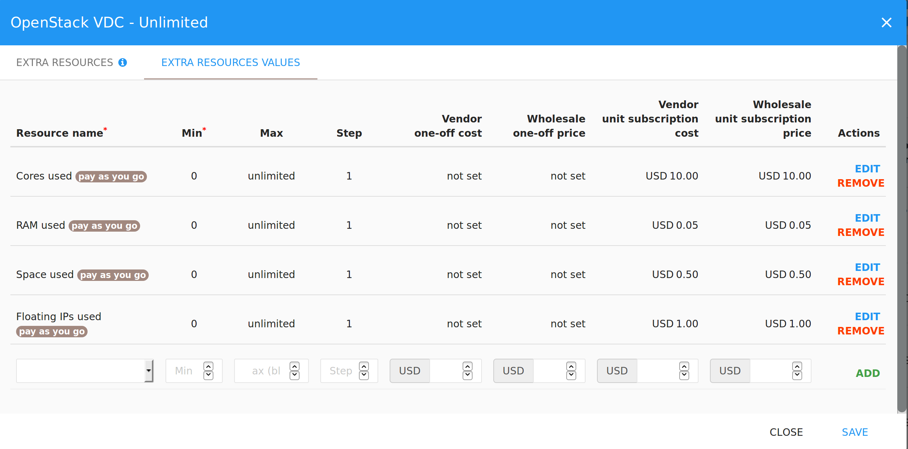

In this section you will learn how to start the onboarding process of your
application on the Cloudesire marketplace.

Please note that the process is different depending on the chosen product type:
you need to clearly understand the differences in order to onboard your product
successfully.

> In order to see your product visible on the marketplace, it should at least
> have one **Plan** set to _published_.

## Start the onboarding process

To start the onboarding process, go to the marketplace and login to access your
personal Control Panel.

Select _"Catalog"_ from the left menu, then select _"Products"_ and click on the
**Create New Product** button at the upper right hand corner.

You will see a pop-up in which you can  insert your product name and choose
between different onboarding options:

* **Syndicated Product** to start onboarding a new product in
  [Syndication](syndication.md) mode;
* **Docker Application** to start onboarding a new product in [Self-Deployment
  mode using Docker packages](docker.md);
* **Service Product** to start [onboarding a new service](service.md), that is
  not tied to the distribution of an application to the end-user;
* **API Product** to onboard a new [API-based service](api-product.md).

Additional product types exists, but can be created and assigned to a vendor
only by an administrator:

* **CSP Product** to onboard a new Microsoft/Azure product, see the [CSP
  Product](csp-product.md) section;
* **VM Product** to onboard a new bare Virtual-Machine with customer SSH access,
  see the [VM product page](vm.md).

## Applications Catalog (Marketing & Sales Onboarding)

In this section you will understand how to add your application to your own
catalog, fill the product description, select the right pricing model and
publish it into the Cloudesire marketplace catalog.

### Understand the Catalog

The **Catalog** contains all the applications owned by the vendor. In this section
you can see both applications that are already published on the marketplace and
applications that are still in configuration phase.


### Catalog Elements & Instructions for Completing the Product Description

The following picture shows the structure of a product in the Catalog section.


Please note that you can save your project by clicking on "_Save Product_" on
the top right at any time: this means that you can exit the platform and edit
your product later. Please remember that if you edit an application that is
already published on the marketplace and select "_Save Product_" changes will be
live. This is one of the reasons why we recommend to upload and test changes on
our Staging Marketplace (more info on the Staging Marketplace, [click
here](onboarding.md#staging-marketplace).)

The following information are required for each product in the catalog:

### General Information

* _Product Logo_: high-resolution logo with fully transparent background.
* _Product Name_: your application name. It's the name that will be associated
  with your product on the marketplace.
* _Category_ (e.g. CMS, CRM): this will help customers to understand your
  product category and will be shown on your product page on the marketplace.
* _Destination_ (B2B or B2C):  this will help customers to better understand
  your product and will be shown on your product page on the marketplace.
* _Tags_ (keyword list): these tags will help customers to quickly understand
  your product. Please, try to add only relevant tags to avoid too many tags on
  the product page.
* _Long and Short Description_ (text): they will describe your product to
  customers. Please try to be as relevant as possible: we suggest to keep the
  short description really short and explain the product in depth in the long
  description. You will have extra sections to add benefits, features, details
  of the product versions, terms and conditions and privacy policy, so please
  try to focus only on your product and your ideal target. We recommend to add
  the reasons why a customer should choose your product and the value
  proposition of your solution. We suggest to avoid extra-long descriptions:
  bullets can be very useful to avoid long paragraphs. This is the first thing
  customers will read about your product, so please make sure it is clear,
  catchy and without typos. Also, if your application is available in Italian
  and English, don't forget to add the long and short description in both
  languages. You can switch language with the flag on the right of "_Short
  description_" and "_Long description_".

Plus, you will find some extra fields:

* _SKU_: your product ID. You cannot change it once the product has been
  created.
* _Type_: this field will be different according to your previous choice. If you
  chose "_Docker Product_" the field will be "Managed" and you will have to
  upload Docker image in the following field. If you chose "Syndicated Product"
  you will need to enter the syndication endpoint in the following field.

### End-User Information

* _End-user instructions_: in this field you can add optional information that
  can be provided to the customer to help him during the first access to the
  newly purchased application. Examples are default login and password or video
  tutorials. Users will see these instructions in the dashboard. If your
  application is available in Italian and English, don't forget to add the long
  and end-user information in both languages. You can switch language with the
  flag on the top right.
* _Features and benefits_ (ordered list): you can add features and benefits of
  your application, one at a time. Please try to be clear and relevant:
  customers will see this list as it is. We suggest to insert 3 or 6 features
  and benefits and avoid long lists. If your application is available in Italian
  and English, do not forget to add the long and short description in both
  languages. You can switch language with the flag on the right.
* _FAQ_ (ordered list of Questions and Answers): you can add some relevant FAQs
  about your product. Remember to add questions that can be relevant to help
  customers to choose your product, not only troubleshooting questions. If your
  application is available in Italian and English, don't forget to add the long
  and short description in both languages. You can switch language with the flag
  on the right.

### Visuals

* _External Video URL_: your YouTube video will be shown on the product page, so
  avoid videos that are only tutorials or videos that are really long. A short
  and effective video on your product is a good choice.
* _Cover: _this picture will be used in the Marketplace slider, if the product
  is marked as "featured". Please add a high-resolution image.
* _Screen-shots_ (list of images): these images will be shown to customers, so
  please upload high-resolution pictures. Remember that is the first time that
  potential customer will see your application: we suggest to upload the main
  sections of your application or a demo of the product and avoid every single
  screen, if that's not useful.

### T&C

* _Terms of Service_: users will be able to read the terms of service of your
  application. Please insert a text and not a link.
* _Service Level Agreement_: users will be able to read the service level
  agreement of your application. Please insert a text and not a link.
* _Privacy Policy_: users will be able to read the privacy policy of your
  application. Please insert a text and not a link.

### Custom metrics

* Application Metric (AKA _Custom Metrics_) represents _facts _of a specific
  application offered in the Cloudesire Marketplace that are relevant for
  software vendors. To better understand custom metrics and how to add custom
  metrics to your application, please read [this
  section](onboarding.md#application-metrics).

### Configuration Parameters

* a list of parameters that have to be filled by customers before using the
  application for the first time, either for the application to work properly or
  to provide better initial customization (more details
  [here](onboarding.md#configuration-parameters-detailed)). Examples are: zip
  code, company name, VAT number, street address, etc.

### Plans

* plans show one or more available _product versions_ (e.g. silver, gold,
  platinum, etc.): each version (or "plan") can have a specific **recurrent
  license** and/or a one-off **setup price** or can be offered for free. There
  are so many options that we wrote a section entirely dedicated to plans and
  pricing models. We strongly recommend you to read it before you define plans
  for your product. You can find more information about pricing models
  [here](billing.md).

### SSL (only for Docker Applications)

* The vendor's SSL certificate and SSL certificate private key (to be used to
  access the virtual-machine containing the running instance of the application)

## Billing Information (Plans)

### What are plans

For each application, vendors can define one or more **Plans **(or "Versions",
e.g. _silver_, _gold_, _platinum_, etc.).

In short, plans are the product versions that will be available for your
product. In the following picture, you can see an example of the two product
versions created for a product: one is the monthly plan and one is the annual
plan.


### How to add Plans to your product

To add plans you need to go to access your personal Control Panel. You will be
able to access the "_Catalog_" from the menu on the left. Then you need to
select the product you want to edit, click on it, select "Edit" and go to the
"Plans" section.

Then, click on the "Create New Plan" button at the top right of the screen. You
can now create your product plan.

If you have already created a plan and you want to edit you can do it by
selecting a specific Plan, and clicking on the "Edit" button. A pop-up will show
up, similar to the one in the following picture:


For each _Plan_ the vendor has to specify the following information:

#### General

* _Plan Name_ (text): this is the name of the plan and will be shown to
  customers, so try to keep it easy to understand. For example, you product
  could have a gold/silver/platinum versioning, a basic/pro/enterprise
  versioning, a monthly/annual versioning and so on.
* _Plan Description_ (text): in this field you need to describe the features of
  that specific plan. If your application is available in Italian and English,
  do not forget to add the long and short description in both languages. You can
  switch language with the flag on the right.
* _Published_ (yes/no): if set to "yes" customer will see this version and will
  be able to activate it.
* _External ID_: this ID is useful to refer a custom "external" identifier for
  the specific plan

#### Features

* _Configuration Parameters_: a selection of the previously specified (at the
  product level) parameters. More details
  [here](onboarding.md#configuration-parameters).
* _Trials Allowed_ (yes/no):  you can allow a trial for your product version. We
  suggest to enable trials of product.
* _Trial length_ (in days): the duration of the "trial mode", if offered to the
  customers for the specific Plan.
* _Auto-renewal_ (yes/no): if "yes", the plan will auto-renew when the
  subscription is about to expire. For example, a monthly subscription could
  renew automatically each month.

#### Pricing

* _Product Price_ (per billing period): it is the recurrent price that will be
  billed to the customer for that product version at each billing period, for
  example 10 EUR per month.
* _Activation Fee_: one-off price that the customer will pay only once, when the
  order is placed in the marketplace. It is a setup fee.
* _Revenue Sharing Quota_: only for admins
* _Deployment fee_ (optional, only for admins)
* _Billing frequency_ (in months): how often the customer will be billed for
  this product version. For example, it could be monthly, bimonthly, yearly,
  etc. (for further information see [this section](billing.md)).
* _Short Living Subscription_ (yes/no): it's also possible to specify a
  _short-time_ billing frequency; that means that the subscription duration will
  be less than a day, and needs to be specified in hours.

#### Extra-Resources tab

* _Extra-resources_: they are goods or services which can be sold together with
  the application. Examples are a 10-days pack of Technical Support, some
  hardware components, extra credits, etc. For further information see [this
  section](onboarding.md#extra-resources).

#### Advanced Settings

* _Self-billing_ (yes/no): for admin only. More info on [Self-billing
  section](billing.md#self-billing).

## Pricing Models

In this section we will focus on pricing models. The Pricing Model configuration
section is one of the most important aspects of product configuration. Since it
directly influences your product sales, it is important to understand which the
most common pricing models available on the platform.

You can deeply customize the pricing model for your product in Cloudesire (for
example, you can add extra resources to your product LINK), but the choice of
the right pricing model is not always easy. That's why in the following
paragraphs you will find an introduction to the most used pricing models in SaaS
businesses.

### Available pricing models

There are many different basic pricing models that you can implement in
Cloudesire. To define a pricing model, you need at least one product into your
catalog. Select the product, then "_Edit_" and go to the "_Plans_" tab.You can
edit or add new plans to your product.

#### Freemium Model

The Freemium model is a good way to find new customers for your application.
With this model, you allow customers to use your application with basic features
for free and switch to premium features in paid plans.

The challenging aspect is that you need to find ways to push customers to switch
to premium versions: this means that you need to define the pricing model with
at least two product versions and understand which features of your product
could push users to pay. For example, premium version could include more users,
more credits, more storage or more services than the free version: you need to
understand which is the right hook.

Examples of SaaS business using this model are Hootsuite and Dropbox.


#### Pay-as-you-go Model

Pay as you go model means that your users pay only for what they use, so it's a
good choice if you want to reduce the entry barrier for customers. This offers
flexibility to customers, but your product needs to have an effective metering
system. Also, you need to understand how to segment your offer. Usually, you
lower the price of items for larger volumes, so that users are pushed to buy
more items to save money.

iStock is an example of Pay as you go pricing model


#### Pay-per-user Model

Pay per user Model means that your customers move up and down the tier
automatically, so the cost scales according to how they use the product. For
example, you pay 30$/month up to 10 users and 50$/month up to 15 users. The
challenging aspect of this model is that you do not have a constant flow of
revenues, they can move up and down and it's not predictable.

Slack is an example of a SaaS business that follows this model.


#### Fixed Pricing Model

The Fixed Pricing Model is a good way to offer different versions of your
product to different targets and generate consistent revenues. If you have a
product that can target different customers and you can define different pricing
tiers, you could benefit from the fixed pricing model.

For example, you could create a silver version for freelance professionals, a
gold version for small companies and a platinum version for large companies.

Hubspot is a successful example of business that offers a fixed pricing model.


#### Feature Based Model

Feature Based model means that you create different pricing tiers based on
features. The challenging aspect of this model is that you need to identify
which features add to each tier, so that customers are willing to pay up to get
them.

Salesforce is an example of a business that offers a feature based model.

[Pricing models: Feature Based model](/img/docs/feature-based-model.png)

## Extra Resources

In this section you will learn what extra resources are and how you can add them
to your product plans.

### Understand an Extra Resource

Extra Resources refer to _goods_ or _services_ which can be sold together with
the application (for example, a 10-days pack of Technical Support, hardware
components, extra credits, etc.) for which the customer will pay a recurring
price on each billing period.

### Create and add an Extra Resources to your Product Plans

To define a new Extra Resource, you need to have already created a product in
your catalog with at least one plan. Over to the plan where you want to define
Extra Resources and select "_Extra Resources_" action.

You will be required to add:

* _Resource Name_: the name of the extra resource. It will be shown to the
  customer in the marketplace.
* _Identifier_: please make sure this is a unique identifier for the extra
  resource.
* _Measuring Unit_: the measuring unit of the extra resource, for example hours,
  credits etc. You can select the measuring unit from the drop-down menu
* _Type_: *Tiered*, *Volume* and *Stairstep* pricing scheme. Learn more about
  the difference in the [dedicated
  section](billing.md#extra-resources-pricing-schemes).
* _Description_: a short description of the extra resource. Please try to be
  clear and brief.
* _Required_ (yes/no): if the customer has to buy this resource to complete the
  product activation.

Then, click on the "Add" button on the right.


The next step is to define the quantity ranges and their pricing. Go to the
"_Extra Resources Values_" section and fill:

* _Resource Name_: select from the combo-box on the left a previously created
  Extra Resource
* _Min_: Start quantity for the current interval (should not overlap the
  previous one)
* _Max_: End quantity for the current interval (may be empty in the last range to avoid defining an upper bound)
* _Step_: should be greater than 1. Decide which are the effective quantities
  inside the specified interval that are selectable by customers (e.g. with an
  interval from 0 to 100 and a step of 5, customer can buy a quantity of 0 or 5
  or 10 or 15 and so on)
* _Unit Price_: cost per quantity
* _One-off cost_ (optional): a setup price added one-time only



Repeat these steps to add multiple Extra Resources, when you're done click on
the *Save* button.

The following screenshot shows an example of Extra Resources linked to a
specific Product Plan.


### Retrieve Extra Resources quantities for an active subscription via API

To retrieve the _Extra Resources Values_ specified by the customer during the
order placement, you can fetch the _Subscription_ resource using the [Cloudesire
API](api.md):

    GET /api/subscription/{id} HTTP/1.1

The response will contain the information explained in [this
section](syndication.md#retrieve-the-subscription-resource-after-a-subscription-created),
plus the `billingItems` property, which contains the chosen value for the extra
resource.

    HTTP/1.1 200 OK
    Content-Type: application/json

    {
        ...
        "billingItems": {
            "billingItem/1": 100,
            "billingItem/2": 50,
        },
        ...
    }

## Technical Onboarding

This section focuses on the technical aspects of the onboarding. We made the
technical onboarding as smooth as possible, anyway we strongly recommend you to
read this section before onboarding your product and during the onboarding
process.

### Onboarding for Syndicated and Docker applications

The technical part of the onboarding process depends on the application
_provisioning type_:

* for **Syndicated Applications**,  the software vendor
  has to provide a "_syndication endpoint_" and proceed with the integrations
  via API, as described in [this
  section](syndication.md)
* for **Docker Applications** (where Cloudesire will provision on the cloud a
  new virtual-machine containing a running instance of the application for each
  customer) the software vendor should use [Docker Packaging](docker.md) (a
  self-contained archive of your application meeting the
  [Docker](https://www.docker.com/) standards). More detailed instruction for
  the onboarding of Docker applications can be found in [this
  section](docker.md).
* for **Service**, the same rules of syndicated applications applies, but the
  integration is optional;
* for **API** products, please refer to the [API section](api-product.md).

The following sections refer to other additional functionalities, which can be
used both in the Syndication and Self-Deploy scenarios.

### Application Metrics

#### Understanding Application Metrics

Application Metric (AKA _Custom Metrics_) represents _facts_ of a specific
application offered in the Cloudesire Marketplace that are relevant to software
vendors.

For example, a software vendor could be interested to know how many _documents_
a certain application instance produced in the last month, or how many _active
users_ an application has at a given time.

This kind of information are useful for **monitoring** purposes (i.e. to see a
dynamic real-time graph in the Cloudesire Dashboard), but also allows software
vendors to implement **pay-per-use** pricing models. In fact, specifying a
**unit-price** for a custom metric (e.g. 10 USD per active user) allows
Cloudesire to calculate the related incomes in a certain period of time
(_billing period_) and issue an invoice to the customer. For further details,
take a look at the [Billing Module Section](billing.md).

For each metric you can define from the application metric editing section, the
following information:

* _Name_: a metric unique identifier;
* _Endpoint_: must be defined in the form of a relative URL (e.g.:
  `/metric/users`);
* _Polling frequency_: the platform will poll your endpoint with this frequency;
* _Measuring unit_: the drop-down menu includes units like _Item, Users, Hours,
  MB, GB, Invoice, etc;
* _Unit-price_ (optional): price charged for each application metric value
  received.

#### How to add Custom Metrics

The steps to follow to a add one (or more) Custom Metric to a Product are
slightly different depending on your application _provisioning type_:

##### Adding Custom Metrics to a Syndicated Application

For [Syndicated Applications](syndication.md), you need to access to the product
editing page and go to the "_Metric_" tab.

To find the "_Metric_" tab go to your personal Control Panel. You will be able
to access the "_Catalog_" from the menu on the left. Then you need to select the
product you want to add custom metrics to, click on it, select "Edit" and go to
the "_Metrics_" section.

In the following picture you can see an example of a "_Metrics_" section.

")

By clicking on "_Add New Metric_", you will see a pop-up where you can set up a
new metric.

Fields are:

* _Name_: the name of the metric you want to monitor
* _Polling frequency_: the frequency you want the platform to poll your endpoint
* _Measuring unit_: select the right measuring unit from the drop-down menu,
  according to the metric you want to monitor
* _Custom Endpoint_: the URL you want the platform to poll your endpoint. It
  must be defined in the form of a relative URL (e.g. `/metric/users`)
* _Unit Price_ (optional): the price charged for each application metric value
  received
* _Type_: select Counter or Gauge from the drop-down menu. A _counter_ is a
  cumulative metric that represents a single numerical value that only ever goes
  up, while a _gauge_ is a metric that represents a single numerical value that
  can arbitrarily go up and down.


##### Adding Custom Metrics to Docker application

For [Docker applications](docker.md), you need to access to the "_Modules_"
section (more details [here](docker.md#modules).)

To access the "Modules" section access your personal Control Panel. You will be
able to access the "_Modules_" from the menu on the left.

Once you are in the "_Modules_" section, , select a specific _Module_ and
_Package_ (more details [here](docker.md#packages)), click on the "_Show
Advanced_" button on the top-right of the page. Furthermore, by accessing to the
"_Application Metrics_" tab it's possible to fill all the required fields and
click on the "_Add_" button to finish.


#### How to provide "actual values" for a Custom Metric

To be able to successfully use application metrics, your application should
expose an unique URL for each application metric, reporting the value for that
metric.

The format of the metric data should be in JSON format:

    {
        "metricsName": "current_users",
        "value": 3.0
    }

## Configuration Parameters (detailed)

Applications may require a list of parameters that have to be filled by
customers before using the application for the first time, either for the
application to work properly or to provide better initial customization.
Examples are: zip code, company name, VAT number, street address, etc.

Configuration Parameters are similar to
[Environment variables](docker.md#environment-variables), but their value is
chosen by customers before placing an order.

Each parameter is created and bound to a specific Product, but can be linked or
not to one or more _Plans_. Each parameter can be marked as required, and its
value can be _validated_ by providing a regular expression. In order to support
customers to fully understand the meaning, each parameter has a _description_
and a _hint_.

To specify a Configuration Parameter, enter the Product editing page, then
select the "_Configuration Parameters_" tab.
For each parameter you need to specify:

* _Code_: a unique identifier of the parameter. It is not shown to the customer
* _Name_: a name for the parameter. It will be shown to the customer so it has
  to be clear.
* _Description_: a short explanation provided to the end-users
* _Validation_ (optional): a regular expression to validate the text provided by
  end-users
* _Hint_: text inside the placeholder that helps end-users to complete the field
* _Required_ (yes/no): sets if the customer needs to specify a value for the
  parameter before purchasing the product


Once Configuration Parameters are specified for a product, they need to be
attached to one (or more) "_Plans". To do that, click on the "_Plans_" tab,
select a specific Plan and click on the "_Edit_" button. You will see a pop-up
similar to the one shown in the following picture: go to the "_Features_" tab
and select one or more Configuration Parameters to activate for the specific
Plan.


The [Cloudesire API](api.md) gives the vendor the possibility to retrieve both a
specific Configuration Parameter definition and the related parameters "value"
(namely the valued specified by the customer during the order placement).

Configuration Parameters values can be retrieved via API fetching the
_Subscription_ object:

```http
GET /api/subscription/2388 HTTP/1.1


{
    "id": 123,
    "configurationParameters": {
    "configurationParameter/2095": "param1 value", 
    "configurationParameter/2096": "param2 value"
    }
}
```

To fetch the definition of a specific parameters you can invoke:

```http
GET /api/configurationParameter/2095 HTTP/1.1

{
    "code": "PAR01",
    "description": "Your blog domain",
    "hint": "Specify the domain from which your blog will be reachable",
    "id": 2095,
    "name": "domain",
    "required": true,
    "self": "configurationParameter/2095",
    "validation": "^(?:[-A-Za-z0-9]+.)+[A-Za-z]{2,6}$"
}
```

If your application provisioning type is [Managed](docker.md), the
Configuration Parameters are automatically injected in the virtual-machine for
Docker applications as an environment variable with the same name of the
`code` parameter: in case you have created a Configuration Parameter with
_COLOR_ as `code`, your application will have a `$COLOR` environment variable
with the value chosen by the customer.

## Auto-login

If you enable auto-login, your customers will be able to access your application
without providing any specific credential (typically username and password).

### Why you should use auto-login

It would be great to give the customer the possibility to auto-login to your
application without providing any credentials, especially in a marketplace. For
instance, it means that your customer will not need to remember credentials for
Cloudesire platform AND your product. Also, you will not need to provide
end-user instructions to the customer to login for the first time to your
application. Long story short, you can provide your customer a smooth and simple
user experience.

### How to enable auto-login

To achieve this goal, we strongly suggest to add an **authorization token** to
the **endpoint** to access the application. In this way, you can recognize the
customer and enable automatic log-in into your application.

If you follow this flow, you don't need to specify the user credentials into the
_end-user instructions_ anymore.

## Integration Facilities

In this section you will find an overview of the integration facilities provided
by Cloudesire to help developers during the onboarding process.

### Staging Marketplace

#### Why you should use the Staging Marketplace

While developing the integration with the Cloudesire platform, it's useful to
run some tests on our _Staging Marketplace_, where payments can be done with
demo credit card numbers and where you can test the whole customer journey,
end-to-end.

> We strongly recommend to test applications on the staging marketplace to
> discover integration issues before the application is published on the
> marketplace.

#### Staging Marketplace URL and API endpoint

A [Staging Marketplace](https://frontend-staging.cloudesire.com/) is freely
available.

The API endpoint can be found in the [API documentation](api.md#domains) section.

On this marketplace you can freely create as many accounts as you wish, both
vendor and customers, and you can use the [fake credit
cards](https://stripe.com/docs/testing) numbers to simulate payments.

> Manage API endpoints as configuration parameters in your source code since
they need to be changed when publishing your application in a different
marketplace.

#### How to test the customer experience on the Staging Marketplace

To fully test your integration source code, once you have finished the
application onboarding process we strongly suggest you to:

* register to the staging marketplace as a new _customer_
* go to [registration
  page](https://frontend-staging.cloudesire.com/cp/register), and
  create your own customer account following the instructions on the screen.
* login to the marketplace with the previously created customer credentials
* go to [homepage](https://frontend-staging.cloudesire.com/),  select
  "log-in" at the top right corner of the screen, enter username and password
  and click login
* go to your application page
* you can browse applications or look for your application using your
  application name
* buy your application (providing a testing credit card number)
* use a [test credit card](https://stripe.com/docs/testing)
* wait while the provisioning process ends

Once the application is ready (the entire process shouldn't require more than a
few minutes) you will see in your dashboard an interface similar to the
following screenshot (which refers to a running _trial):


By clicking on the "_Launch application-name_" button the customer will be
redirected to a view where:

* the application runs in the **body** of the page
* the **header** of the page contains the running application name and version
  and provides some tools (bookmark, end-user instructions, customer profile
  details, etc.). This header will be also used to provide useful notifications
  (subscription about to expire, private messages, etc.).Also, from this section
  customers will be able to go back to Cloudesire.
* a **customer support** tool is available (to give the customer the possibility
  to send direct messages both to the platform administrators and vendors).
  Those messages will be managed by an integrated **trouble-ticketing system**


