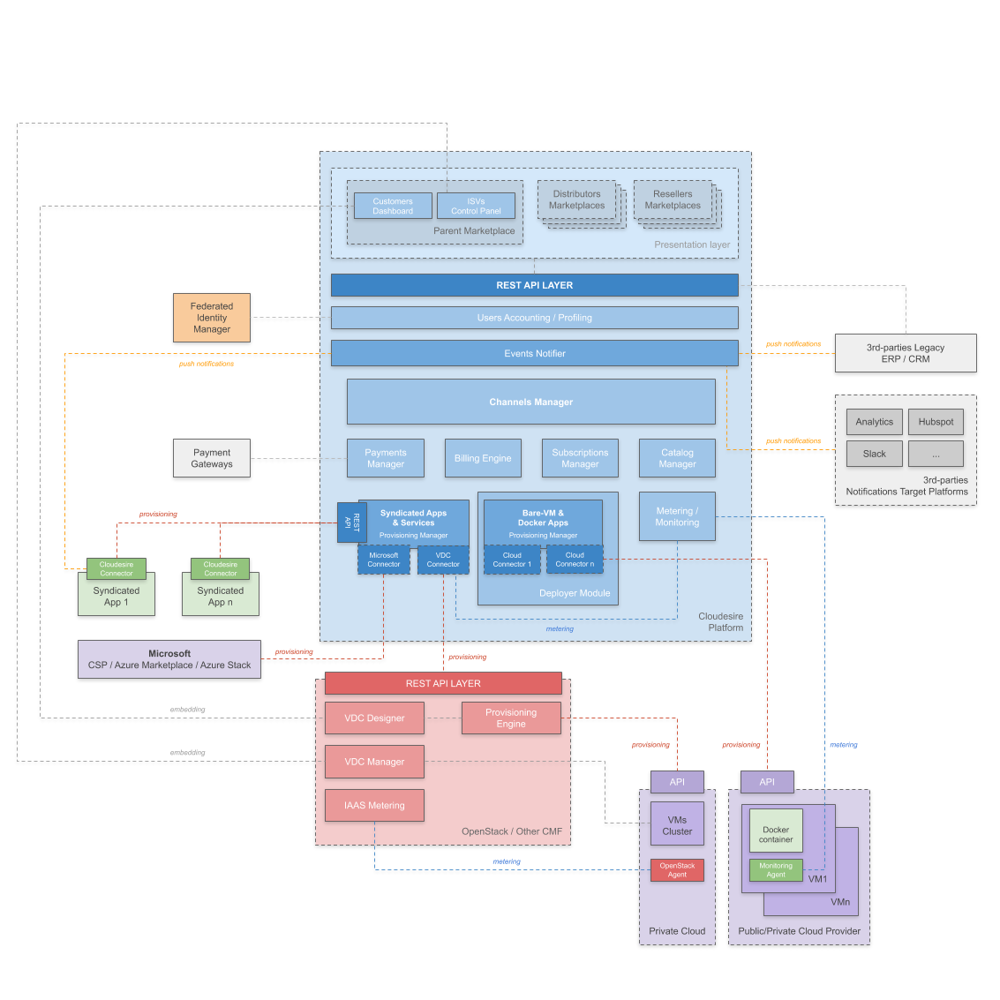

The main components of the Cloudesire platform can be summarized as follows:

* **Backend**: it represents the "core" of the platform and consists in a set of
  independent multi-thread modules that uses messaging queues to enable
  asynchronous, distributed and redundant messaging among components, allowing
  enterprise integration patterns. Each module exposes a **REST API** that is
  used consumed by the other modules and by the web interfaces.
* **Control panel**: a responsive web application that allows users to manage
  different entities, according to their role: customers can see their orders
  status and check availability of their instances; vendors can manage their
  application catalog, active customers, orders and running instances of their
  applications; administrator can manage the entire platform and receive updates
  from the monitoring and alerting systems.
* **Marketplace**: a responsive web application where a software vendor can
  publish its own products, along with others vendors products. Customers can
  browse the catalog, compare products, rate and comment them, place orders or
  try an application (if the vendor allows it).

## Backend

Cloudesire backend is composed by the following modules:

* **CMW**: the core of Cloudesire, handles most of the business logic related to
  the catalog, customers, subscriptions and billing. CMW also includes the
  **Persistence Layer**: a *PostgreSQL* database managing all the relational entities
  of the platform (as regards the additional resources, such logos, screenshots, etc.
  the platform typically leverages a dedicated *Object Storage*, like for example
  a platform owner's AWS S3 tenant).
* **Deployer**: manages cloud resources for BareVMs. The deployment process is
  described [in the next chapter](platform.md#deployer-workflow). It leverages
  open-source libraries (e.g. jclouds) and cloud SDKs to connect via API to
  [Public and Private cloud providers](clouds.md).
* **Monitor**: an API that exposes system and application for statistics and
  real-time graphs. Data store is based on the open-source [Prometheus
  monitoring](https://prometheus.io/) system. System metrics are collected via
  the open-source [node-exporter](https://github.com/prometheus/node_exporter)
* **Metrics-exporter**: hook bandwidth metrics gathered from public cloud
  providers into the Monitor for pay-per-use bandwidth consumption.
* **Logger**: an API that expose VM logs. Data store is based on the open-source
  [graylog](https://www.graylog.org/) logging platform.
* **Marketplace-api**: enables real-time customization of parent, distribution
  and reseller marketplaces (logo, description, theme, etc.)
* **Hubspot-connector**: allows the integration of Cloudesire user-base into the
  Hubspot CRM
* **Feedback-api**: an API to collect user support requests and forward them to
  ticket systems.
* **Keycloak**: enables SSO capabilities for marketplace users
* **cassetto**: manage catalog resources (logos, screenshots, etc.) on object
  storage systems.
* **Janine**: open-source PDF invoice generator
* **Vivace**: API to calculate a background color from an image (used
  for products logo into the marketplace)

### Available integrations

 There is a list of [available integrations](index.md#available-integrations).

### Deployer workflow

Deployer implements a state-machine to manage the deployment process on a
specific cloud provider, following this workflow for BareVM products:

* Check prerequisites, depending on the cloud provider, e.g. existence of a
  particular network, management of ssh key, security groups and general
  firewall rules
* Creates a new **VM** (through the cloud provider APIs), having a specific
  "size" defined by the vendor (i.e. 2 cores, 1GB RAM)
* Customer SSH public key login is configured
* Creates and attaches a **data disk** to the VM, where application and user
  data can be stored
* End-user receives a notification (via email and in its own control panel
  interface) with all the instructions needed to access its own instance of the
  application he paid for (URL, default login and password)

Deployer also manages the provisioning of bare VM products, but in this case no
data disk will be attached and no configuration take place into the VM.
